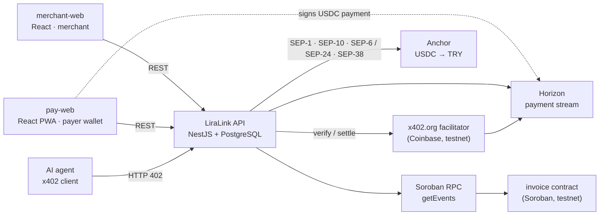

# LiraLink

A Turkish merchant or exporter creates a **payment link** priced in Turkish lira. A customer **abroad** opens it on their phone and pays in **USDC on Stellar** from their own wallet. LiraLink detects the on-chain payment within seconds, converts it to lira through a **Stellar anchor (SEP-6 or SEP-24)**, and the merchant sees a **TRY balance** paid out to their IBAN. The merchant never touches crypto: they sell in lira and receive lira. Built for Rise In × Stellar Pro (Istanbul, 19–20 Sept 2026) by team MersiErOfis. **Testnet only.**

## Live

| | URL |
|---|---|
| Merchant panel | https://merchant-web.tutorialplatform.com |
| Payer page | https://pay-web.tutorialplatform.com |
| API docs (Swagger) | https://liralink-api.tutorialplatform.com/docs |
| API health | https://liralink-api.tutorialplatform.com/api/health |

## Architecture



## Three payment rails

The same link can be paid three ways. Each row is a real testnet payment to a live link:

| Rail | How the payer pays | Testnet tx |
|---|---|---|
| **contract** | `invoice.pay(code, payer)` on the Soroban invoice contract; the API sees the `paid` event over RPC | [`86a52cb9…`](https://stellar.expert/explorer/testnet/tx/86a52cb90e16be242a957630b9addce55fd43b5686c85fdef876e54ecb01bfca) |
| **memo** | Classic USDC payment with text memo = link code; the API matches it from the Horizon stream | [`4ad45c72…`](https://stellar.expert/explorer/testnet/tx/4ad45c721428ca476e04e2cf5c0fbcff489bac2c74119e82ff72de0d4608594c) (memo `WQ6M53V2`) |
| **x402** | An agent calls `GET /api/pay/:code/agent` → `402` → signs a USDC transfer → the facilitator settles → `200` receipt | [`289f442b…`](https://stellar.expert/explorer/testnet/tx/289f442b395f7f64bd87a0c0980aabc266dca651d274fbed7582b21b18b1526e) |

Amounts are locked at link creation (exact-amount policy): underpayments keep the link open for a top-up, and any excess is parked as `unallocatedUSDC`, never silently converted.
The memo rail is the wallet-friendly default. x402 is **experimental**: it runs on Stellar testnet only, through the x402.org facilitator operated by Coinbase, which we don't control. Try it from `backend/`:
`AGENT_SECRET=$(stellar keys secret payer) npm run agent:pay -- --code <CODE> --api https://liralink-api.tutorialplatform.com/api`.

## Anchor integration

USDC → TRY settlement is an anchor **withdraw** per paid link, in two flavours behind one adapter interface. Both share SEP-1 discovery, `/info` limit checks and SEP-10 web auth; the API then sends the USDC to the anchor with the memo it asked for and follows the transaction to `completed`, netting the fee (`feeUSDC`, `netTRY`). The signed payment is stored before submit, so a retry can never pay twice. Full walkthrough, including an *observed vs documented* table of where the anchor departs from its docs: **[docs/anchor.md](docs/anchor.md)**.

- **SEP-6 — `ANCHOR_PROVIDER=sep6`, the Turkish lira rail.** Against the hackathon's official TRY anchor, **[`tr-mock-anchor.fly.dev`](https://tr-mock-anchor.fly.dev)**. Fully programmatic, with no human step and no interactive page (`interactiveUrl` is always null):
  - **Each merchant is its own anchor user.** The shared platform account logs in with SEP-10 *memos* (`sub` = `G…:<merchant memo>`), so every merchant gets a separate anchor identity and transaction history.
  - **Payouts go to the merchant's IBAN.** It is registered over **SEP-12** before the merchant's first withdrawal and again whenever it changes.
  - **Withdrawal:** `GET /withdraw` returns the treasury account and a `MEMO_ID`. `netTRY` is the lira the anchor reports paying out.
  - **Exchange rate:** the rate comes from the **Reflector USD/TRY oracle** on Stellar, through the anchor's **SEP-38** price endpoint (~48 TRY/USDC after a 50 bps spread). With `FX_PROVIDER=anchor`, a link locks that rate instead of the mock 34.00, so the USDC quoted is what the settlement really clears at.
  - **Verified live:** an e2e settles ~1 real testnet USDC to `completed`, paid to the merchant's IBAN with a FAST bank reference.
- **SEP-24 — `ANCHOR_PROVIDER=sep24`, the interactive rail.** Against SDF's `testanchor.stellar.org` (USD out). The settlement stays `processing` and exposes the anchor's `interactiveUrl`; the merchant panel shows a "Complete verification" button, the person fills in KYC and bank details on the anchor's own page, and the backend picks it up within a minute. Nothing is ever marked failed while the anchor waits. A live e2e settles 1 testnet USDC, and a manual e2e walks the browser KYC path.

The live demo still runs the `mock` adapter (same interface); flipping it to `sep6` is a one-line `.env` change, checklisted in [docs/anchor.md](docs/anchor.md).

## Stellar skills used

- **Classic payments + text memos, USDC trustlines, Horizon streaming:** the core memo rail and the payment listener (cursor-persisted, idempotent per operation).
- **Soroban smart contract (Rust, soroban-sdk):** `contracts/invoice` with admin-auth `create`/`cancel`, payer-auth `pay` through the **USDC Stellar Asset Contract**, RPC `getEvents` polling, and TS bindings in `packages/invoice-client`.
- **SEP-1 / SEP-10 / SEP-6 / SEP-24 / SEP-38:** anchor discovery, web auth with challenge verification, programmatic and interactive withdraws, and rate quotes — all in `backend/src/anchor`, sharing one `AnchorSession`.
- **TR Mock Anchor skill:** [`skills/anchor-tr`](skills/anchor-tr/SOURCE.md) — the hackathon's official `SKILL.md` for `tr-mock-anchor.fly.dev`, vendored unmodified. It is the source for the SEP-6 adapter (endpoint layout, treasury address, the `Memo.id` requirement, SEP-38 asset ids); `SOURCE.md` records where the running anchor disagrees with it.
- **Stellar standards skill:** [`skills/standards`](skills/standards/SOURCE.md). Its anchor section pointed us to SEP-1/10/24 (SEP-12 not used), and the adapter is checked against those specs in [docs/anchor.md → Spec review](docs/anchor.md). Upstream has no separate anchors skill.
- **x402 agentic payments:** from the official Stellar skill [`skills/agentic-payments`](skills/agentic-payments/SOURCE.md), vendored unmodified from `stellar/stellar-dev-skill`.
- **Stellar Wallets Kit / Freighter:** the payer connects and signs in pay-web.

Contract ID, wasm hash and deploy txs: **[docs/deployments.md](docs/deployments.md)** (`CDKZYQI4…45EJ`, testnet).

## Regulatory note

The payer is **outside Turkey** and pays in USDC from their own wallet. The merchant only ever sells in and receives **Turkish lira** and never touches crypto. Conversion runs through a **licensed Stellar anchor**, which is the regulated party in the flow. Turkish rules restricting crypto as a *domestic* payment instrument therefore do not apply to this flow.

Custody is a documented hackathon simplification: one platform account holds USDC, and merchant balances are ledger rows (see `backend/README.md`). This is our engineering framing, **not legal advice**. A formal legal opinion will be obtained before any production launch.

## Team — MersiErOfis

- **Hasan** ([@movilidadagil](https://github.com/movilidadagil)): backend + integrations (API, Horizon listener, SEP-24 anchor, Soroban contract, x402)
- **Vuslat** ([@vuslattt](https://github.com/vuslattt)): merchant web + pitch deck
- **Yunus** ([@Yunussoydan33](https://github.com/Yunussoydan33)): payer web (PWA, Stellar Wallets Kit)

## Roadmap

- **Real TRY anchor:** swap the mock adapter for a licensed Stellar anchor with a TRY off-ramp (the SEP-24 adapter is already built and tested).
- **Per-merchant accounts:** replace the single custody account with segregated on-chain balances per merchant, then non-custodial per-link SEP-24 withdrawals.
- **DeFindex:** deposit each settlement's auto-save share into a DeFindex USDC vault instead of only ledgering it.
- **Soroswap path payments:** let the payer pay with any asset, routed to USDC.
- **Reopen expired KYC sessions:** `POST /settlements/:id/reopen` ([#10](https://github.com/mersierofis/liralink-demo/issues/10)).

---

## For developers

Read `docs/00-PROJECT.md` first (product, data model, API contract §6), then your app brief: `docs/01-BACKEND.md` (Hasan), `docs/02-PAY-WEB.md` (Yunus), `docs/03-MERCHANT-WEB.md` (Vuslat).

```
docs/            specs, api.types.ts, anchor.md, deployments.md
backend/         NestJS API              → backend/README.md
merchant-web/    React + Vite            → merchant-web/README.md
pay-web/         React + Vite PWA        → pay-web/README.md
contracts/       Soroban invoice contract
packages/        invoice-client (generated TS bindings)
skills/          vendored Stellar skills
```

Toolchain (binding): Node **22.23.2** (`nvm use`), `@stellar/stellar-sdk@16.3.0` in both backend and pay-web (see `docs/00-PROJECT.md` §8). Local Postgres: `docker compose up -d`.
